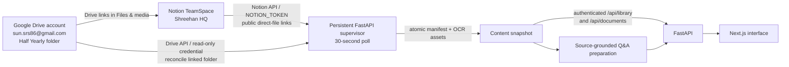
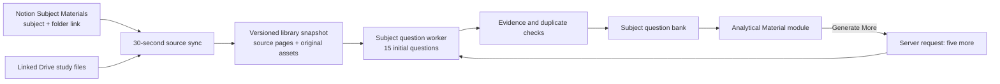
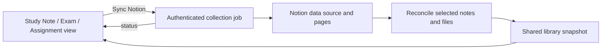

# Project pivot: Class II half-yearly study source

Updated: 2026-09-27 (Asia/Dhaka). Keep this working brief current when source scope, sync behavior, question generation, or deployment changes.

## Source of truth

The application connects directly to the **Shreehan HQ** TeamSpace in the Shreehan Notion workspace. Its half-yearly records link to the [Shreehan / Mapleleaf / 2 / Half Yearly Google Drive folder](https://drive.google.com/drive/folders/1pg3lbrlzwxJClmKCMQEpZg-9aMIrHnwr), owned by the connected account `sun.srs86@gmail.com`. Notion pages and databases remain the application's primary workspace source; the linked Drive folder supplies original study files. Sync its descendants, including future additions, edits, renames, moves, and deletions. Exclude unrelated parts of Drive.

The folder was inventoried and its 17 files reviewed on 2026-09-27. The three-page syllabus and all 15 Science images were read; the 12-page image-only Geography PDF was rendered and checked page by page. `Study Notes` was empty at that check. Drive may change after this observation. On a later check, the [Notion Half Yearly syllabus record](https://app.notion.com/p/3e59ecdd38af80919219c6c9968e08b4) was fetched again: its body is a template, while `Files & media` links to the readable three-page `syllabus.pdf` in Drive. The PDF covers Class II half-yearly 2026–2027 subjects, including Science, Geography, Bangla I/II, Islamic Studies, and Moral Studies; the Bangla page has legacy-font text encoding and needs visual review.

```text
Half Yearly/
├── Syllabus/
│   └── syllabus.pdf                    3 PDF pages
├── Study Notes/                       empty at review
└── Materials/
    ├── Science/
    │   ├── 59.png–66.png              Food for Health, 8 textbook pages
    │   └── 84.png–90.png              Rocks and Minerals, 7 textbook pages
    └── Geograpgy/                     spelling as found in Drive
        └── Geography.pdf               12 scanned PDF pages, textbook pp. 14–25
```

### Source analysis

| Source | Coverage | Limit |
| --- | --- | --- |
| [syllabus.pdf](https://drive.google.com/file/d/1wjYczLYdFtruV5ETLMPUKpIXGuq2qVr0/view) | Maple Leaf International School, Class II July session, Half-Yearly Examination 2026–2027. English, mathematics, science, history, geography, spelling, Bangladesh Studies, poetry, reading, drawing, Bangla I/II, Islamic Studies, and Moral Studies. | A syllabus lists topics; it is not an answer source for missing lessons. It says content can change without notice. Bangla extracts with legacy-font encoding and needs visual review. |
| [Science pp. 59–66](https://drive.google.com/drive/folders/1Ul6d6t91xoKfAp9dJ8I3W1hNfeA-FgJV) | Food for Health: plant/animal foods; energy-giving, body-building, and protective foods; meals; healthy eating; exercises and picture tasks. | Photographed textbook content, not completed answer sheets. |
| [Science pp. 84–90](https://drive.google.com/drive/folders/1Ul6d6t91xoKfAp9dJ8I3W1hNfeA-FgJV) | Rocks and Minerals: hard/soft rocks, granite/marble/sandstone/chalk/slate, minerals and everyday uses, gemstones, exercises and diagrams. | Page 84 is mainly a colouring activity; blank exercise lines are not an answer key. |
| [Geography.pdf](https://drive.google.com/file/d/1ENILHb56Lr3r9Edf1YpTvk02En-ML-1a/view) | Textbook pp. 14–25: shape of land and river journey; volcanoes; world wonders; everyday weather and symbols; extreme weather. PDF pages 1–12 correspond to textbook pp. 14–25. | Scanned with no embedded text. OCR is needed for search and automatic Q&A. |

The syllabus specifies **Food for Health** as seen Science and **Rocks and Minerals** as unseen Science. Geography textbook pp. 14, 16, 18, 20 are seen; pp. 22 and 24 are labelled unseen; diagrams matter. Mathematics says exam numbers will change. The folder does not currently contain lesson pages for most other syllabus subjects, so the app must disclose those gaps instead of inventing answers.

### Verified mathematics syllabus extract

Read from the [PDF linked by the Notion Half Yearly syllabus record](https://drive.google.com/file/d/1wjYczLYdFtruV5ETLMPUKpIXGuq2qVr0/view), page 1: **Joy of Mathematics, Book 3** — page 44 exercises 1–5; pages 46, 48, and 53; page 97 exercises b and c; page 98 exercises 1–5. **Mental Mathematics** — exercises 18, 21, and 25. Numerical values will be changed in the examination. **Geometry** — circle, semicircle, and square, with diagrams and definitions to be done in class.

## Source-grounded Q&A examples

These are review examples, not an official school answer key. The practice engine should regenerate from current file versions and link every answer to its original page.

| Question | Model answer | Evidence |
| --- | --- | --- |
| Which three groups divide the food we eat? | Energy-giving, body-building, and protective foods. | [Science p. 60](https://drive.google.com/file/d/1PogeSgCwEPMr3YHiYjm83bZu77KUuDXi/view) |
| Name one energy-giving food. | Rice. | [Science p. 60](https://drive.google.com/file/d/1PogeSgCwEPMr3YHiYjm83bZu77KUuDXi/view) |
| What are the three meals usually eaten in a day? | Breakfast, lunch, and dinner. | [Science p. 61](https://drive.google.com/file/d/1f_n6U3bZPacPYcY_5GbNm1SQDTRcIxKn/view) |
| Give one healthy eating rule. | Wash your hands before and after eating. | [Science p. 62](https://drive.google.com/file/d/1Drd8uuLVroPf_lfSL7EGhSJh6TcwAJ8I/view) |
| What are all rocks made of? | Minerals. | [Science p. 86](https://drive.google.com/file/d/11a21L7w-1d6jze0eUE6n8yyYOi8yeBFb/view) |
| Which rock is used for kitchen counters? | Granite. | [Science p. 85](https://drive.google.com/file/d/1-xeTXMNEoumEUFFlAy-z1QC0wWQSvJcS/view) |
| Which mineral is used as the “lead” of a pencil? | Graphite. | [Science p. 86](https://drive.google.com/file/d/11a21L7w-1d6jze0eUE6n8yyYOi8yeBFb/view) |
| Where does water from mountains flow? | Through streams and rivers toward the sea. | [Geography.pdf](https://drive.google.com/file/d/1ENILHb56Lr3r9Edf1YpTvk02En-ML-1a/view), PDF p. 1 / textbook p. 14 |
| What did the trout pass on its journey to the sea? | It passed a waterfall, dodged a fisher’s hook, and swam past an otter. | [Geography.pdf](https://drive.google.com/file/d/1ENILHb56Lr3r9Edf1YpTvk02En-ML-1a/view), PDF p. 1 / textbook p. 14 |
| What comes to the surface through volcanoes? | Hot rocks from under the ground. | [Geography.pdf](https://drive.google.com/file/d/1ENILHb56Lr3r9Edf1YpTvk02En-ML-1a/view), PDF p. 3 / textbook p. 16 |
| What three wonders did Azim see? | An iceberg, a cave, and the northern lights. | [Geography.pdf](https://drive.google.com/file/d/1ENILHb56Lr3r9Edf1YpTvk02En-ML-1a/view), PDF pp. 5–6 / textbook pp. 18–19 |
| What happened when Mika’s gentle breeze became a gale? | The wind blew into his umbrella and lifted him into the air before he fell into a pond. | [Geography.pdf](https://drive.google.com/file/d/1ENILHb56Lr3r9Edf1YpTvk02En-ML-1a/view), PDF p. 7 / textbook p. 20 |
| Which weather symbols are shown for a storm? | A cloud, rain, and lightning. | [Geography.pdf](https://drive.google.com/file/d/1ENILHb56Lr3r9Edf1YpTvk02En-ML-1a/view), PDF p. 10 / textbook p. 23 |
| Name two examples of extreme weather shown in the book. | A tornado and a flood. | [Geography.pdf](https://drive.google.com/file/d/1ENILHb56Lr3r9Edf1YpTvk02En-ML-1a/view), PDF pp. 11–12 / textbook pp. 24–25 |

Question generation rules: cite a real Drive file and PDF/image page; retain textbook page numbers in image titles; use Class II vocabulary; vary short answer, MCQ, true/false, fill-in, and diagram prompts; preserve the original page for visual checks; reject low-confidence OCR and unsupported answers. Do not use the syllabus alone to answer a missing lesson. Recheck examples when files change.

## Integration architecture and sync contract



The application reads Notion directly. The connected Notion workspace is `Shreehan`, and the verified TeamSpace is `Shreehan HQ` (ID `2a79ecdd-38af-8100-95a3-0042c2ae1b84`). The integration imports active pages shared with its Notion token; Notion API search is scoped by integration sharing rather than the TeamSpace ID. The connector review found the `6. Subject Materials` and `2. Syllabus` databases. Half-yearly records contain Drive links in `Files & media`, including Science and Geography folders and the syllabus PDF. These links identify sources; a Notion page does not itself contain every binary in the linked Drive folder. The importer records those links and uses a separate **server-side read-only Drive credential** to enumerate and download the configured root folder. ChatGPT plugin access is for this review and does not authenticate the deployed application.

The persistent FastAPI supervisor starts the Notion importer at startup and schedules subsequent checks every **30 seconds** (`NOTION_SYNC_INTERVAL_SECONDS=30`, minimum 30). A check cannot overlap itself: if OCR or network work exceeds 30 seconds, the next check begins after completion. Browser views refresh `/api/library` every 15 seconds. Imported files are versioned, extracted/OCRed, and published with Notion records as one snapshot. Errors retain the last complete library; sync health reports partial, delayed, or failed states. Changed source files invalidate derived questions by checksum. The storage directory still uses `.notion-sync` for compatibility.

Set `CONTENT_SOURCE=notion`, `NOTION_TOKEN`, `GOOGLE_DRIVE_FOLDER_ID`, and either `GOOGLE_DRIVE_SERVICE_ACCOUNT_JSON` (with access to the folder) or all three OAuth settings `GOOGLE_DRIVE_CLIENT_ID`, `GOOGLE_DRIVE_CLIENT_SECRET`, `GOOGLE_DRIVE_REFRESH_TOKEN`. Keep secrets server-side. If Drive credentials are absent, Notion records can sync but linked Drive files are marked pending; this does **not** meet full folder synchronization. A live isolated importer run on 2026-09-27 succeeded with **8 Notion records, 3 Drive links, and 1 direct attachment**; it correctly reported `partial` and `drivePending=true`. The local `.env` has a Notion token but no Drive credential, so a live end-to-end Drive sync has not been verified.

The app now imports publicly downloadable **direct Drive file links** in Notion without a Drive API credential, while retaining the Notion page and Drive file URLs as sources. This covers the current syllabus PDF. A local FastAPI run at `http://127.0.0.1:8000` on 2026-09-27 imported 8 Notion records and 2 files, including `syllabus.pdf` (3 pages); the app retrieval path found **Joy of Mathematics** on page 1. The worker completed repeated syncs and advertises a 30-second interval. The status remains `partial` until a Drive API credential permits recursive folder reconciliation. Public direct-file access is an observed property of this specific link, not a substitute for Drive folder authentication. The frontend build, 19 JavaScript sync tests, and 19 Python tests passed.

Production currently uses Vercel plus a GitHub Actions sync workflow scheduled every five minutes. That schedule **does not satisfy a 30-second production sync requirement**. A persistent worker with the above credentials and access to the shared snapshot store is required for 30-second production polling; this deployment change is still outstanding. The model's connected plugins cannot operate as that worker. Verify the first live sync, file edit and deletion, OCR, and Q&A against the deployed snapshot before calling production synchronized.

## Observed Notion integration points

| Notion source | Linked Drive item | App use |
| --- | --- | --- |
| [6. Subject Materials, Science](https://app.notion.com/p/3c49ecdd38af801598a9d777830f768e) | [Science folder](https://drive.google.com/drive/folders/1Ul6d6t91xoKfAp9dJ8I3W1hNfeA-FgJV) | Subject metadata plus original textbook images. |
| [6. Subject Materials, Geography](https://app.notion.com/p/3e79ecdd38af80efbd7cc972e4949a95) | [Geography folder](https://drive.google.com/drive/folders/1285u1rum6poCTWWGwl69ABZYrROm0uj2) | Subject metadata plus scanned PDF. |
| [2. Syllabus, Half Yearly](https://app.notion.com/p/3e59ecdd38af80919219c6c9968e08b4) | [syllabus.pdf](https://drive.google.com/file/d/1wjYczLYdFtruV5ETLMPUKpIXGuq2qVr0/view) | Exam scope and coverage gaps. |

## Decisions and verification still needed

- Add a runtime Drive credential with read access to the half-yearly root folder, then verify an actual combined Notion/Drive snapshot. Never place the credential in this file or frontend settings.
- Move production sync to an always-on worker if the 30-second requirement also applies to the deployed Vercel app. The existing GitHub schedule remains five minutes until that deployment is changed.
- Confirm whether later uploads for other syllabus subjects should enter practice automatically. Current question preparation covers readable linked study files and excludes syllabus-only answers.
- After each future project instruction, update this file with the resulting architecture, source scope, integration details, decisions, and verified status.

## Local account operation (2026-09-27)

The `adm1` password was reset in the persistent `shreehan-data` Docker volume using the application's password hasher. The password itself is deliberately not recorded here. Existing sessions were revoked. The host `data/shreehan.db` has no users and is not the account store for this login. The local app now runs at `http://127.0.0.1:8000` in container `shreehan-hq-pivot-local`, using the persistent volume and the current repository code through read-only mounts. Login, session validation, and `/api/library` each returned HTTP 200 during verification; the test session was then revoked. A fresh Docker image build on this arm64 host failed while compiling the `libsql` package, so the local container currently uses the existing image and mounted current source rather than a newly built image.

## Subject Materials → Analytical Material (2026-09-27)

The dashboard's **Analytical Material** module lists subjects from Notion's `6. Subject Materials` records. The previous dashboard label, **Unseen Paper**, has been renamed; internal component filenames and legacy collection fields remain as compatibility identifiers. The current Notion records include [Science](https://app.notion.com/p/3c49ecdd38af801598a9d777830f768e), [Geography](https://app.notion.com/p/3e79ecdd38af80efbd7cc972e4949a95), and English Literature. Their available linked materials include 15 Science images and one 12-page Geography PDF. English Literature currently has no readable linked file in the local snapshot.

Account controls: the dashboard sidebar no longer shows **Sign out all devices**. The profile's regular **Sign out** action remains available; the authenticated logout-all API remains for existing clients and tests.

The Analytical Material module now has an authenticated **Sync Notion** button. It starts a manual Notion/library refresh, then analyzes Subject Materials for source-linked questions, while a progress bar reports sync and question preparation progress. Existing source data stays available during the refresh. Completion can be partial when files are unreadable or linked Drive folders cannot be fully listed; without a server Drive credential, the UI explains that newly added Drive folder files cannot be discovered. The local persistent worker supports this manual job; Vercel has no persistent job worker and returns an unavailable response until that deployment is changed.

Manual sync verification on 2026-09-27: the authenticated POST returned HTTP 202; progress advanced through Notion record import and question analysis to 100%, and finished `partial` with the Drive credential limitation stated. It refreshed 9 Notion records and 19 documents. Existing Science and Geography banks were available; English Literature had no readable document and remains partial until material is linked and accessible.

## Drive API key and offline question preparation (2026-09-27)

The local `.env` now contains `G_DRIVE_KEY`. This is a 39-character Google API key, not a Google user OAuth token or service-account credential. The application now recognizes it for Drive API requests to publicly accessible folders and files. A live `files.get` request for the configured Half Yearly root folder returned **HTTP 403**, so this key does not authorize the app to enumerate the private folder as `sun.srs86@gmail.com`. The importer handles that denial without aborting Notion synchronization: it retains direct Notion file imports and the known public-file index, and sets `drivePending=true`. Newly added files inside private Drive folders still require OAuth refresh-token settings or a service-account JSON shared onto the source folder. The API key value is never logged or recorded here.

Live sync on 2026-09-27 refreshed **9 Notion records and 19 documents**, with no pending OCR extraction. It completed with the expected partial Drive status because of the 403. Direct files attached to Notion pages can still be downloaded when their links are accessible; discovery of later folder uploads or deletions is not verified until user-scoped Drive access is configured.

The configured OpenRouter model returned **HTTP 402** for the current generation request, so the model could not produce drafts. The worker now normalizes common model question-type labels and can map shortened OCR evidence back to exact source sentences when the provider is available. For this OCR-heavy current set, a local source-backed fallback has been added so users still receive complete study banks during provider outages. The refreshed local Analytical Material banks are **15/15 English Literature**, **15/15 Geography**, and **15/15 Science**, all saved as `ready` and each question links to the supporting source page. Geography questions cover the textbook’s weather stories; Science questions cover Food for Health and Rocks and Minerals; English Literature questions cover The Ice King. Future subjects with readable material use the same AI path and generic evidence-checked fallback; an unreadable/insufficient source remains partial rather than receiving invented answers.

The persistent worker continues source polling and subject analysis at the configured 30-second interval. The API key alone cannot make private Drive additions visible to that worker. To satisfy full automatic folder sync, provide one of the server-side OAuth or service-account configurations described above.

The running local container was also checked: it does not currently inherit `G_DRIVE_KEY` from the host `.env`; its saved banks remain readable and its existing counts were Geography **30/30**, Science **15/15**, and English Literature **20/20**, all `ready`. After replacing English Literature and Science with the improved fallback banks, every saved question in those banks matched its cited page excerpt; all 30 Geography questions also matched cited source excerpts. The `.env` key will need to be added to the container environment if future deployment changes rely on it, but doing so alone will still return 403 for this private folder.



The subject worker groups files by their Notion Subject Materials subject, samples readable pages across each subject, and creates an initial set of **15 questions and model answers per subject**. OCR pages need at least 60% extraction confidence; a lower threshold admitted a damaged Geography word that changed a statement's meaning, so that bank was invalidated and regenerated. The worker checks each question for a verbatim supporting excerpt on the cited page, supported answer format, and duplication. The Analytical Material module shows the Notion subject list, linked source files, answers on reveal, and page links. Its **Generate More** button requests five newly generated questions per click; the persisted target rises by five only after the previous target is complete. Source file or extracted text changes invalidate that subject's bank and restart the initial 15. The local question worker retries every 30 seconds; browser data refreshes every 15 seconds.

The current local runtime has no Drive API credential. As an interim bridge, `data/subject-materials-index.json` records the 16 file IDs verified through the connected Drive account; public file downloads let the local sync read their contents. It refreshes known files hourly. The index cannot discover later uploads or deletions in those folders. Full automatic reconciliation, including future Subject Materials files, still requires a server-side read-only Drive credential. The user has been asked which credential can be provided. No plugin credential is copied into the application.

The local FastAPI endpoint is `POST /api/subject-practice/{subject}/generate-more`; `/api/library` includes `subjectPractice`. Production's scheduled sync can publish subject banks, but the current Vercel runtime cannot handle interactive Generate More because it has no persistent worker. That production capability remains outstanding until an always-on worker or equivalent request path is deployed.

Verification: frontend production build passed; the 14 existing JavaScript source-sync tests, ten selected Python content/worker tests, and two new subject-bank tests for OCR filtering, 15 initial questions, +5, and source invalidation passed. Both Geography and Science reached 15 source-linked questions locally. An authenticated `Generate More` request returned HTTP 200 and increased Geography from 15 to 20 questions; a further request brought it to 25. The restarted local `/api/library` endpoint now reports Geography 25/25 ready and Science 15/15 ready. During live verification, Python and JavaScript sorted Drive IDs differently; a source-set comparison replaced positional comparison so the API no longer hides Science's completed bank.

## Generate Q&A removal (2026-09-27)

The briefly added **Generate Q&A** 15-question batch control was removed at the user's request, along with its dedicated progress display, API endpoints, and script mode. **Generate More** continues to add five questions per click, while the background worker prepares the initial 15 for each subject. The separate **Sync Notion** progress bar remains. A local Science batch run before removal produced 15 source-linked questions and left its saved bank at **35/35 ready**; removing the control does not erase saved questions. The local app continues to run at `http://127.0.0.1:8000`.

Release verification: the removal and source-sync changes were pushed to GitHub `main`; the linked Vercel production deployment reached `READY` at `https://shreehan-notion.vercel.app`. The public login page returned HTTP 200, and an unauthenticated `GET /api/library` returned HTTP 401. The GitHub Notion sync workflow for the application revision completed successfully. The frontend production build, 19 JavaScript sync tests, and ten selected backend tests passed. A local `.vercelignore` update excludes development databases and other workspace artifacts from uploads. Production still uses the five-minute GitHub sync schedule and cannot provide the requested 30-second guarantee without a persistent worker.

## Study Note, Exam, and Assignment collection sync (2026-09-27)

Each of these three dashboard collection views now has its own **Sync Notion** button. It starts an authenticated local job for that collection, reports the current stage and counts of notes and files added, changed, or removed, and refreshes the visible collection when complete. Synced Notion notes and their attached files are listed in the matching view, including Exam. The sample First Monthly exam schedule remains a separate static display and is labeled as such.

The local FastAPI routes are `POST /api/collections/{collection}/sync` and `GET /api/collections/{collection}/sync`, with an allowlist of `Study Note`, `Exam`, and `Assignment`. `scripts/sync-collection.mjs` calls the existing Notion importer in collection mode. The importer discovers current Notion pages, reconciles the selected collection by stable record/file IDs, preserves other collections and their attachment cache, and retains the last complete workspace sync timestamp. It waits for the existing import lock when a background sync is active. The previous saved collection stays available if a source request fails. The existing 30-second local worker continues whole-workspace updates independently.



Local verification: the Next.js production build, 20 JavaScript sync tests, and ten selected backend tests passed; a focused test covered add, edit, and removal of notes/files while preserving Exam content during a Study Note sync. All three authenticated local POST requests returned HTTP 202 and completed. The current Notion data sources contain no publishable Study Note or Exam rows and one blank Assignment template row, so each live run correctly reported zero changes and showed an empty collection. A browser check confirmed the button is visible in all three views. Vercel still lacks a persistent worker for manual collection jobs; the deployed buttons report this limitation.

## Repository and HTTP boundary cleanup (2026-09-28)

Shared Next.js components and helpers moved to private `frontend/app/_components/` and `frontend/app/_lib/` folders. Route files remain in the normal App Router layout. The FastAPI entry point delegates cross-origin write checks and response headers to `backend/security.py`. Unsafe browser requests from another origin or site are rejected; responses have no-sniff, frame blocking, referrer, permission, cache and resource-policy headers. HSTS is set on production HTTPS responses. The existing document-specific sandbox CSP is preserved.

Tracked Finder metadata, a local inspection SQLite database and its GUI project, and generated `next-env.d.ts` were removed from the repository; ignore rules prevent their return. Two obsolete diagnostic launcher scripts were deleted. Baseline study PDFs and images remain because seed data and practice refer to them. The Docker runtime now includes `scripts/sync-collection.mjs` so the new collection controls work in a persistent container. Credentials remain server-side and are not part of the source tree.

The removed inspection database existed in earlier Git history of the public repository. This commit removes it from the current tree, but history cleanup would require a separate coordinated rewrite and review of any sensitive contents. Production still needs a persistent worker and suitable Drive access to meet the requested 30-second, complete Notion/Drive synchronization contract.

Verification before release: Next.js production build, 20 JavaScript sync tests, 22 backend tests, and a production npm dependency audit passed (zero reported vulnerabilities). Commit `436b6f9` reached GitHub `main`; its GitHub Notion sync workflow completed successfully. Vercel deployed that commit to production with `Ready` status, and `https://shreehan-notion.vercel.app/login` returned HTTP 200 with the new security headers. The deployed manual collection sync still requires a persistent worker and returns an explanatory unavailable response on Vercel.

## Study Notes Class 2 question banks (2026-10-05)

### Implemented architecture and source scope

Study Notes now has its own subject-based question view with answer reveal, original-page links, vocabulary, short answers, fill-in-the-blank and true/false practice. `/api/library` exposes `studyNotePractice` independently of Analytical Material. Banks share the atomic question snapshot but use `Study Note:<subject>` keys. Both the persistent 30-second question worker and the existing five-minute GitHub production workflow prepare these banks. Manual local Study Note collection sync also runs preparation. Vercel manual collection jobs still require a persistent worker; scheduled production synchronization remains the supported path.

Study Notes preparation runs locally, with no external model calls: it imports explicit school Q&A, vocabulary and marked true/false answers, derives cloze exercises from complete answer sentences, and recognizes simple definitions in native Notion notes. Native note text is stored as a versioned `Note` document. Questions carry an exact evidence excerpt, source document ID and page. Source replacements, text edits, subject changes and deletions invalidate or hide obsolete answers. Notes without sufficiently readable supported content remain pending/partial rather than receiving invented answers. The reader refreshes every 15 seconds. New pages must be shared with the Notion integration. Accessible direct PDFs attached/linked to Notion work; private Drive-folder discovery still needs server-side Drive access.

A checksum-bound reviewed bank supports the current Science worksheet and visually verified Bengali questions. Its answers cannot carry over to a changed PDF checksum. Future legacy-font Bangla PDFs fall back to Bengali OCR; low-confidence OCR requires review. Study Notes are excluded from the external-model Subject Materials and Unseen Paper paths, including Drive-origin notes. An automatic approval review rejected exporting private Study Notes to the external generation provider, so this feature uses local processing instead.

### Observed content and verification

A live Notion import found 15 records and 25 files, including five Study Notes PDFs (10 pages): Science (3), History (1), English Literature (2), Bangladesh Studies (2), and Bangla Paper I (2). The Bengali PDF has legacy-font text; its two rendered pages were visually checked. Science's three rendered pages were also checked. The local preparation produced 111 questions: Science 15, History 13, English Literature 31, Bangladesh Studies 37, and Bangla Paper I 15. These are source-based study answers, not independently corrected school answer keys.

The 24 JavaScript tests and 23 backend tests passed, including collection reconciliation, local-only generation, subject-bank isolation, source replacement/removal and hiding stale answers. The final frontend production build passed. A browser check against the built app and imported snapshot verified all five subject filters and answer reveal; the real collection import-plus-analysis job also completed successfully. Commit `515d03d` was pushed to GitHub main and Vercel reported READY. Production sync run `37338870084` completed and published 25 documents. Reading the production snapshot confirmed all five current banks. Two Bengali entries initially failed evidence matching because Linux and macOS Poppler reorder one legacy-font glyph; exact, checksum-bound alternatives now cover both observed extractions. Release checks also found a Next.js critical advisory in 16.3.5; the dependency is patched to 16.3.8, the production build and 24 sync tests pass again, and npm reports zero vulnerabilities. The patched release is awaiting its final push/deploy verification.

## English Language Analytical Material (2026-10-05)

Implemented a local, reviewed question bank for **A Present for Paul**, PDF page 1 / textbook page 16, in English Language Subject Materials. The original scan was visually read. Twenty authored questions cover comprehension, simple inference, grammar, vocabulary, cloze, multiple choice and true/false. The existing worker publishes 15 initially and can add five through the persistent runtime's Generate More route. Each answer retains its source page and an exact OCR excerpt; the reviewed bank is bound to the original document ID and SHA-256 so replacement files cannot inherit its answers. Reviewed pages bypass external model generation and generic OCR fallback. Other subjects and Study Notes keep their existing paths. No later story events or missing pages are assumed.

Observed verification: 26 JavaScript sync tests passed, including reviewed-source isolation, 15-to-20 growth and changed-source invalidation; the Next.js production build passed. Local preparation reached 15/15 ready. Release `1599812` was pushed to GitHub main. Production sync run `37341346564` succeeded, reported English Language **15/15 ready**, and published 25 documents. Vercel deployment `dpl_HFKzzmvYuJTPVvCUmqxL1NKQg9Kr` is **Ready** and aliased to `https://shreehan-notion.vercel.app`; the CLI lost its connection after build, but a separate deployment inspection confirmed success. Production `/login` returned 200 and unauthenticated `/api/library` returned 401. All 20 reviewed candidates also validated against the actual imported OCR page. The existing five-minute GitHub sync publishes the bank; Vercel still does not support interactive Generate More without a persistent worker.

## Signup email OTP with Resend (2026-10-05)

Implemented server-side Resend HTTPS delivery through the existing FastAPI mailer with `RESEND_API_KEY` and `RESEND_FROM`. Plain-text and HTML messages explain the ten-minute expiry and distinguish signup from password recovery. Existing SMTP remains available when Resend is absent. Partial Resend settings and delivery failures fail safely; Vercel cannot fall back to console OTPs even if APP_ENV is unset. Signup transaction rollback permits retry after failed delivery. The login view supports OTP autofill and explains expiry/spam-folder checks. The existing hashed challenges, five-attempt limit, resend cooldown and single-use password tickets remain authoritative. No study-source scope or question-generation integrations changed.

Observed external configuration: the Resend account contains a sending-access Onboarding key but **no verified domains**. The inspected project environment files contain no email-provider credentials. Live signup email delivery remains blocked on a usable server-side key and verified sender domain; no inbox delivery is claimed. See `docs/EMAIL_OTP.md` for setup and operational checks. Verification: all 36 backend tests passed, including signup through a mocked Resend adapter, delivery rejection/timeout, rollback and retry, and protection against production OTP logging. The Next.js production build and diff checks passed. Vercel production environment listing confirms no email-provider credentials are set. Release `e7922a4` was pushed to main and deployed successfully as Vercel `dpl_DwDRMbrvY8vJiyWbmyTjugoRFMjs` (READY), aliased to https://shreehan-notion.vercel.app. Production smoke checks returned 200 for login, 401 for unauthenticated library access, and the expected safe 503 for signup without email credentials. Live inbox delivery and user-entered OTP verification remain unverified until the required Resend configuration is provided.

### Resend credentials supplied (2026-10-05)

Saved the supplied Resend API key and `shreehan@resend.dev` sender as sensitive Vercel Production environment variables. No code, architecture, study sources, or database schema changed. The key is excluded from documentation and Git. Redeployment `dpl_4Q2UvktGQB12L6rzFRf8QGGBbdrg` completed READY with a successful production build. Automatic approval review rejected the proposed live test OTP send pending explicit recipient/send authorization; no test email was sent and API acceptance/inbox delivery remain unverified. The shared resend.dev domain remains restricted to test recipients; general signup delivery requires verification of an owned sender domain.

## Resend production testing settings (2026-10-05)

Saved the user-supplied `RESEND_API_KEY` and `RESEND_FROM=onboarding@resend.dev` as sensitive Vercel Production variables. No secret was written to source files. The existing mailer uses these settings on redeployment. This sender supports restricted testing, not arbitrary signup recipients; a verified domain remains necessary. Source scope and architecture are unchanged. Vercel deployment `dpl_4h6dyrjU5iFHMdirFgvo56zxnhLE` reached READY and is aliased to https://shreehan-notion.vercel.app. The production build passed. The live signup resend endpoint returned HTTP 200 with `delivery=email` for the user’s existing unverified account, confirming Resend accepted the email. Inbox receipt and user-entered OTP completion remain unverified.


## Teacher classroom (2026-10-06)

### Implemented architecture and decisions

`/teacher` is the teacher landing page; `/coursework` is the student submission and feedback page, linked from Overview, Homework List, and Assignment. The shared Next.js client view uses authenticated FastAPI `/api/coursework` routes. Additive `teachers` and `coursework` tables use the existing SQLite/local and Turso/production adapter. Teacher privilege is assigned only by the explicit provisioning script; signup cannot set a role. The account named `teacher` is provisioned with a PBKDF2 hash of the requested initial password, which is omitted from Git. Its reserved `teacher@accounts.invalid` address prevents inventing a personal teacher email; email password recovery requires a future real address. Provisioning never resets an existing teacher or promotes an existing ordinary account.

In this single-school application, teachers can choose any activated non-teacher account as a student. They manage only records they created; students see and submit only their own records. Teachers can create and edit homework/assignments, set a due date (tomorrow in Asia/Dhaka by default), mark pending/completed, save optional integer marks 1–10 with interactive stars, and write remarks. The exact eleven requested subjects are supported (Geography capitalization normalized). Student text submissions include timestamps. Completed work must be reopened by the teacher before resubmission; resubmission clears the prior score and review timestamp.

Existing synced Notion Homework blocks and Homework/Assignment records are selectable as sources in the creation form. Importing one assigns a snapshot to a chosen student, retaining its source identity and original Notion URL; duplicate source assignment for the same teacher/student is rejected. Classroom grades and comments are app-owned and do not write back to Notion or alter source sync. Existing study-source scope, Drive credentials, question generation, and production sync limitations are unchanged.

The **Email remarks** button sends saved remarks through the existing server-side Resend credentials to the fixed parent address `sun.srs86@gmail.com`. Unsaved remarks cannot be emailed. Resend idempotency keys suppress repeat sends of the same saved version within the provider's idempotency window. Failures return a retryable message without losing reviews. API acceptance is reported as acceptance, not inbox receipt. Tests mock the provider; no live remarks test message has been sent.

### Observed verification and release status

All 39 backend tests passed, including teacher/student role enforcement, cross-account isolation, record creation/editing, submission/review/reopen transitions, invalid marks/dates/subjects, source deduplication, fixed email recipient and provider failure. All 26 existing JavaScript source-sync tests passed; their process-identity checks require execution outside the local sandbox. The Next.js static production build passed with both new routes. Production Turso additive schema migration and teacher provisioning completed successfully. The Playwright browser workflow passed: teacher login redirect, all eleven subjects, create work, independent student submission, teacher rating and completion, reload persistence, student feedback, and 390px mobile layout without horizontal overflow. Desktop, mobile, and mobile creation-dialog screenshots were visually inspected. Final GitHub/Vercel release verification remains in progress.

Reproduce browser verification with `npm --prefix frontend run build`, then `.venv/bin/python -m backend.tests.classroom_server`, and `cd frontend && E2E_CLASSROOM=1 E2E_BASE_URL=http://127.0.0.1:8017 npx playwright test tests/teacher.spec.ts`. The fixture creates disposable test accounts in a temporary database; it never provisions test credentials in production.


The first teacher release `115eec9` reached GitHub main and Vercel deployment `dpl_DP2W5tqn5csWFqQWGjfKxxK4a8T8` reached READY at `https://shreehan-notion.vercel.app`. Live production checks passed for teacher login, role, dashboard HTML, eleven subjects, Notion source access, rejection of invalid self-assignment, logout and HTTP 401 afterward. The live classroom currently offers three activated student accounts and three Notion sources. No work or email was created by the production smoke test.

The deployment audit surfaced two high-severity transitive dependency advisories. The lockfile now pins compatible patched `sharp` 0.35.5 (including its binary/libvips packages) and `source-map-js` 1.2.2. npm reports zero vulnerabilities; the production build and all 26 sync tests passed again. Patched release `23a7fd9` was pushed to GitHub main. Vercel deployment `dpl_8FZDqNUJApVDZboEbi1bSbs8Eyvn` reached READY and is aliased to `https://shreehan-notion.vercel.app`; its clean install also reported zero vulnerabilities. The desktop/mobile browser regression passed again. The final production smoke repeated teacher login using the user-requested credential, teacher role and API checks, eleven subjects, source access, invalid self-assignment rejection, and logout/401 successfully. No test coursework or parent email was created in production. Live remarks inbox delivery remains unverified; provider success/failure behavior is covered by mocked tests.

## Teacher dashboard update (2026-10-06)

### Implemented architecture and decisions

The teacher dashboard now shows **pending coursework cards only**. All eleven subjects have distinct card colors; the pending notification reports the live pending count and submitted items awaiting review, and scrolls to the active cards. The status filter has only All and Awaiting review in the teacher view; the student view still shows completed feedback and marks. Completing a task removes it from the teacher card list after saving. Existing completed records remain in the database and student view.

The **Create Task** form contains work type, one of the eleven subjects, due date, title, and instructions. Student and existing-Notion-source pickers are removed. The new authenticated `POST /api/coursework/class-task` fans out one task to every currently activated non-teacher account in one database transaction. Each student receives their own coursework record, so submissions, marks and remarks remain independent. It rejects creation when no active student exists. Later signups do not receive earlier tasks automatically. The existing single-student API and stored source links remain for compatibility and editing older tasks; no Notion source scope or sync behavior changed. Existing work can still be edited one student record at a time.

The teacher can save a review or choose **Save & email**. The latter saves remarks while pending, sends them to the fixed parent address through the existing server-side mailer, then completes the task when Completed was selected. If delivery fails, the task stays pending for retry. This keeps email available when the pending-only card would otherwise disappear on completion. The star control uses a ten-step color progression and hover/selection motion, with reduced-motion support. The dashboard adds a brighter background and typography, with desktop/mobile card layouts.

### Observed verification and release status

The Next.js static build passed. All 41 backend tests and 26 JavaScript sync tests passed. The Playwright desktop/mobile flow passed for the Create Task form, pending notification/count, subject-colored card, student submission, rating, completion removal, persistent student feedback, and a mocked Save & email sequence without contacting the real mail provider. The 390px layout had no horizontal overflow; desktop and mobile screenshots were visually inspected. Release `69ee719` was pushed to GitHub main; Vercel deployment `dpl_6U5jHd6w9YS1QAkhTCGdo6sDH3wU` reached READY at `https://shreehan-notion.vercel.app`. Live checks passed for teacher login, role, eleven subjects, protected coursework, validation of the new class-task endpoint, rejection of self-assignment, and logout/401. No live coursework or email was created. The distinct-color refinement passed a build and selector check. Vercel deployment `dpl_5wgZY8r8efBotX5D48YFWX6P8ARD` reached READY, and a final production smoke confirmed teacher login, class-task validation, protected APIs, all eleven subject styles, and logout/401.


### Compact teacher header refinement (2026-10-06)

The teacher page header, hero spacing, pending notification, and summary cards are more compact so active work appears sooner at desktop and mobile widths. The notification count and its action remain visible. This is a presentation-only adjustment; teacher permissions, task fanout, Notion/Drive sources, email delivery, and database records are unchanged. The Next.js build passed. A 390px Playwright check put the first pending card within 680px of the top of the page, confirmed no horizontal overflow, and passed the full teacher-to-student workflow. Desktop and mobile screenshots were visually inspected. Vercel deployment `dpl_8viAfyrdiuGexnfYr8uEKxzK3dxR` reached READY and is aliased to `https://shreehan-notion.vercel.app`. Live smoke checks passed for teacher login, dashboard access, all eleven subject styles, protected coursework APIs, invalid class-task rejection, and logout/401; no coursework or email was created. The compact-header commit `4950f1b` is deployed.

## Teacher class-task grouping and status filters (2026-10-07)

### Implemented behavior and decisions

One Create Task action still assigns one coursework row to each active student so submissions, scores, remarks, and completion remain independent. The teacher dashboard now groups rows created by that action into one class-task entry using their shared creation timestamp. Expanding the entry exposes the individual student reviews. This also groups class tasks created before this change. The teacher counts and status filter operate on class tasks: **Completed** means every assigned student row is completed; **Not Done** means at least one is pending; **Awaiting review** means at least one pending row has an unreviewed submission. The form guards against rapid repeat submission. No database schema, Notion/Drive source scope, sync integration, email integration, or student API changed.

The teacher header, banner, summary cards, filters, and task rows use tighter spacing on desktop and mobile. These are dashboard presentation changes; student coursework remains individually accessible.

### Observed verification and release status

The Next.js production build and typecheck passed, along with all five teacher API tests. The isolated Playwright classroom flow with two active students passed: one class-task row for one Create Task action, both student review cards inside it, Not Done and Completed filtering, independent student submission and completion, mocked email action, and no horizontal overflow at 390px. Desktop and mobile screenshots were visually inspected. Commit `b8051fb` was pushed to GitHub main. Vercel deployment `dpl_4zLzdZZF9zhwsoBRwSMXbSbypsfZ` reached READY and was aliased to `https://shreehan-notion.vercel.app`. Live read-only checks returned HTTP 200 for `/login` and `/teacher`, and HTTP 401 for unauthenticated `/api/coursework`. No production coursework or email was created during verification.

## Teacher task record and deletion correction (2026-10-07)

### Observed cause and implemented behavior

A read-only production Turso query showed that each recent Create Task action stored exactly three `coursework` rows with the same creation timestamp, one for each of the three active students. The earlier dashboard release grouped these visually but expanded them into three full task cards, so the teacher still saw three records. The authenticated teacher `GET /api/coursework` response now returns one task entry per creation timestamp with student assignments nested in `assignments`, and the dashboard shows one task heading with compact student review panels instead of repeating the title, subject, due date, and instructions three times. Student `GET /api/coursework` still returns only that student's assignment. The teacher's Completed and Not Done states aggregate the nested assignments as before.

A **Delete record** button on each teacher task asks for confirmation, then calls `DELETE /api/coursework/class-task/{item_id}`. The endpoint checks teacher ownership and removes every student assignment created with that task in one transaction. This also removes submissions, scores, and remarks attached to those assignments. Other tasks are unaffected. Existing class tasks are handled without a schema migration. Notion/Drive source scope, sync, and email integrations are unchanged.

### Observed verification and release status

The frontend typecheck and production build passed. All six teacher API tests passed, including one teacher task for two assignments, cross-teacher delete rejection, student delete rejection, and deletion of only the selected task. The isolated two-student Playwright flow passed, including class task creation, independent review and completion, status filtering, confirmed deletion, and disappearance from the student view. Production deletion was not used for verification. Commit `3ebcbaf` was pushed to GitHub main. Vercel deployment `dpl_BXDj1emXqeyi44ezVefmyJxrRMkP` reached READY and was aliased to `https://shreehan-notion.vercel.app`. Live read-only checks returned HTTP 200 for `/login` and `/teacher`, and HTTP 401 for unauthenticated `/api/coursework`.

## Production account cleanup (2026-10-07)

### Applied change and scope

In the production Turso database, the existing `adm2` account was renamed to `shreehan` while retaining its user ID, email, password, board, dashboard tasks, and coursework assignment. The obsolete `adm` account and its one pending coursework assignment were deleted in the same transaction. Its board, cards, and dashboard tasks were removed by the existing foreign-key cascades. The teacher's other student assignments remain. No schema, application code, local SQLite database, Notion/Drive source scope, sync integration, or email integration changed.

### Observed verification

An independent production readback showed `shreehan`, `adm1`, `teacher`, and the unverified `user` account; `adm` and `adm2` usernames were absent. `shreehan` retained one coursework assignment, one board, and three dashboard tasks. `PRAGMA foreign_key_check` reported no violations. This was a direct production data change; no deployment or login test was performed.

## Role-based administration (2026-10-07)

### Implemented architecture and decisions

An `account_roles` table now stores explicit `student`, `teacher`, or `admin` role overrides. Accounts without an override retain the prior behavior: teacher-table membership means teacher; all others are students. Historical `teachers` rows remain in place as foreign-key references for coursework, even when an account changes to student. Current role, rather than historical teacher-table membership, controls teacher APIs and class-task student targeting. Role changes revoke the affected account's sessions. Administrators cannot change their own role; inactive accounts cannot be promoted.

The `/admin` workspace has Accounts and Setup menus. Accounts lists users and lets an admin assign roles; Setup explains the role workspaces and lets the admin change their password. The client session gate routes admins to `/admin`, teachers to `/teacher`, and students to the learning hub. The backend enforces admin-only account management, teacher-only task management, student-only personal workspace data, and student/teacher access to learning content. Admins are not included in class-task fanout. Existing Notion/Drive source and sync integrations and the email adapter are unchanged.

### Observed verification and production status

The Next.js production build and TypeScript check passed. All 43 backend tests passed, including role changes, admin isolation, historical teacher-reference retention, session role resolution, and class-task targeting; all 26 JavaScript sync tests passed. Release `f441a18` was pushed to GitHub main and its Vercel production deployment reached Ready. Before account activation, a production read-only check found the requested recovery email attached to an unverified `user` account with one pending OTP and no sessions, board, tasks, or coursework.

After the new code was ready, a production transaction activated that pending account as `shuvro` with the requested recovery email and a newly generated password, removed its stale OTP, and set explicit roles: `shreehan=student`, `teacher=student`, `shuvro=admin`. The `teacher` account's historical teacher row and its two authored coursework assignments were retained. An independent readback confirmed all three active roles and no foreign-key violations. Production admin login returned role `admin`; the admin user list showed the requested roles; student tasks, coursework, and learning library APIs returned 403 to admin; logout revoked the session. A real browser verified Accounts and Setup menus, sign-out, and no horizontal overflow at 390px. The initial fast browser test clicked before page hydration and submitted the static form; rerunning after the first auth check passed. No live coursework or email was created or sent.

## Shuvro account and user administration (2026-10-07)

### Implemented architecture and decisions

The existing active production `shuvro` account already had the explicit `admin` role. Its password was reset to the user-requested value with the application PBKDF2 hasher; all previous sessions were revoked. The password and hash are deliberately not recorded here. A readback verified the new password hash before continuing.

The existing admin-only `/admin` workspace now supports creating, editing, viewing, and deleting users. `POST /api/admin/users` creates an active account with a validated username, email, password, selected role, and starter personal data. `PUT /api/admin/users/{id}` updates username, email, role, and optionally password, then revokes that account's sessions. `DELETE /api/admin/users/{id}` removes the account and its authored or assigned coursework in one database transaction; user-owned boards, sessions, OTPs, dashboard tasks, and progress follow existing foreign-key cascades. The current admin cannot edit or delete their own account through the user list; they can change their own password in Setup. The existing role endpoint remains available. All admin APIs require a live admin session. Role changes retain historic teacher rows as coursework references. Notion/Drive source scope, content sync, and email integrations are unchanged.

The Accounts UI lists users and their status, email, and role. Add user and Edit forms set account fields, and Delete asks for confirmation with the data-loss effect stated. The mobile layout keeps names and actions readable. The login gate continues to route admin users to `/admin`.

### Observed verification and release status

The production account lookup confirmed `shuvro` was active and admin before the reset, and the reset readback verified the requested password hash and revoked sessions. The frontend typecheck and production build passed. The admin/teacher tests cover account creation, duplicate rejection, updating details and role, self-edit/delete protection, and deleting an account with authored coursework. The isolated admin browser flow passed for login, listing, add, edit, delete, and 390px mobile layout without horizontal overflow; its screenshot was visually inspected. The combined release was pushed to GitHub main as `458bf3d` and deployed with the menu controls below.

## Administrator menu access controls (2026-10-07)

### Implemented architecture and decisions

A `role_menu_access` table stores enabled/disabled overrides by role and menu key. Defaults allow the existing student, teacher, and admin menus. The new `backend/menu_access.py` catalog defines which menus belong to each role; the admin UI cannot grant a student a teacher or administrator workspace. The administrator Accounts and Menu access controls are locked on, and at least one menu must remain enabled for every role. `GET/PUT /api/admin/menu-access` require an admin session. The `/api/auth/me` response includes the current role's enabled menu keys. The client session gate, student navigation, and admin tabs use these keys; direct requests for disabled top-level pages redirect to the role's first enabled page. API role authorization remains enforced independently. These settings govern menu and page access, not a new permission to call another role's API.

The existing `/admin` workspace now has an interactive Menu access tab showing student, teacher, and admin menus with on/off controls. Changes save immediately and appear after the affected account's next session check. Teacher and student source integrations, sync, and email behavior are unchanged.

### Observed verification and release status

The frontend typecheck and production build passed. All 45 backend tests passed, including rejection of cross-role and locked-menu edits, persisted student library disablement, last-menu protection, and direct-page redirects. The isolated browser flow passed for admin create/edit/delete, disabling the student Document library menu, its disappearance from student navigation, redirecting a direct `/library` visit, and restoring the setting. The teacher browser regression also passed. The 390px admin layout had no horizontal overflow. Commit `458bf3d` reached GitHub main; Vercel production deployment `dpl_52k2r9sEesNA6kRVXuBjqEPzkSna` reached READY and was aliased to `https://shreehan-notion.vercel.app`. Live `shuvro` login with the requested password returned the admin role; the admin user list contained four users, the menu-access API returned all three roles, `/admin` returned HTTP 200, and logout succeeded. No production user or menu setting was changed by the smoke test.

## Teacher calendar, submission dates, and daily admin updates (2026-10-07)

### Implemented architecture and decisions

The teacher task list now starts with a calendar date filter. It matches either a class task's due date or the Asia/Dhaka date of any student submission in that class task. Work-type and class-level status filters remain available; the teacher text search was removed. The list's first desktop column shows the latest submission date and submitted-student count, or “Not submitted”; the due date has its own column. On mobile, those values remain visible in the expanded task row. “Delete record” is in the expanded class-task card, outside the collapsed list row. It still deletes that task's assignments only after confirmation, using the existing teacher-owned endpoint. Student-side search and independent submissions/reviews are unchanged.

A new `daily_teacher_feedback` table stores one full-text note per teacher per Asia/Dhaka day, with timestamps and an admin read timestamp. `GET/PUT /api/teacher-feedback/today` are teacher-only; saving again updates the same daily note and makes it unread again. The teacher form waits for the saved note to load before accepting edits, and sits after the task list to keep active tasks near the top. `GET /api/admin/feedback` lists the latest 100 full-text notes and counts all unread notes; `PUT /api/admin/feedback/{id}/read` records that an admin read a note. Both are admin-only. The `/admin` Teacher updates tab shows the complete note, teacher, day, update time, new/read state, and an unread badge that refreshes every 30 seconds. Its menu entry is always available to admins. No external notification service was added; Notion/Drive source scope, sync, and email integrations are unchanged.

### Observed verification and release status

The frontend typecheck and production build passed. All 46 backend tests passed, covering teacher-only daily upsert, one note per day, teacher isolation, admin-only listing, full text, read state, and resetting unread after an edit. The isolated two-student Playwright flows passed for the teacher calendar matching due and submission dates, latest-submission display, collapsed-row and expanded-card delete placement, feedback save/reload, full-text admin notification, mark-as-read, and mobile layouts without horizontal overflow. The teacher and admin mobile screenshots were visually inspected. Commit `2b6801c` reached GitHub main; Vercel production deployment `dpl_3mDZfQVK5UPEtU1ZkoLBh19i4L3a` reached READY and was aliased to `https://shreehan-notion.vercel.app`. Live checks confirmed `/login` served HTTP 200, unauthenticated `/api/admin/feedback` returned HTTP 401, and a `shuvro` admin session could read the new feedback and menu APIs before logging out. No production coursework, teacher note, or email was created for smoke testing.

## Teacher review workflow and palette (2026-10-07)

### Implemented architecture and decisions

The teacher's updated `docs/TEACHER.md` specifies three review states. An additive `coursework.review_state` column stores `not_done`, `half_done`, or `done`; existing rows are backfilled from legacy completion and review timestamps. The legacy pending/completed `status` remains for student submission locking and existing API consumers. The teacher review API accepts `half_done`, mapping it to a pending legacy status, while `pending` and `completed` map to Not Done and Done. A class task is Done when all student reviews are done, Not Done when all are not done, and Half Done for every mixed or partly done class. The teacher list and individual review selector show the same three labels. The teacher status dropdown is replaced by color-coded tabs, with Not Done selected on landing; the calendar defaults to today's Asia/Dhaka date and can be cleared to see other days. Stars are draft state until Save review or Update to Guardian persists the review.

Save review and Update to Guardian both persist the selected state, rating, and comment, then use the existing server-side Resend path to email the fixed guardian address. Only an accepted email response shows the interactive “Guardian has been notified” message and clears the comment text box. If email delivery fails, the review stays saved, the draft comment remains available for retry, and an error explains that the guardian was not notified. The email body uses the human-readable review state. The teacher's Change password button sits in the header immediately before Sign out, opens an interactive form, and uses the existing authenticated password-change API, keeping the current session while revoking others. No Notion/Drive source scope, sync, guardian recipient, or admin/student styling changed.

The teacher-only palette is accent yellow `#ecad0a`, primary blue `#209dd7`, secondary purple `#753991`, dark navy `#032147`, gray `#888888`, and white `rgba(252,252,252,1)`. Status tabs use yellow, blue, and purple respectively; the daily feedback panel moved above the task list and has a yellow accent. The teacher background is white. The student and admin workspaces retain their existing styles.

### Observed verification and release status

The Next.js production build and TypeScript check passed. All 48 backend tests passed, including the three review states, class aggregation, additive migration/backfill, and human-readable status in guardian email. The isolated Playwright teacher/admin flows passed for default tab/date, hidden status dropdown, unsaved star draft, review save, guardian notification with mocked email, cleared comment field, teacher password-form validation, admin feedback regression, and 390px mobile layout without horizontal overflow. Teacher desktop and mobile screenshots were visually inspected.

The first GitHub release `2bfe806` reached Vercel Ready, but its first live request returned HTTP 500. Vercel logs traced startup failure to a remote libSQL stream invalidated when the schema `ALTER TABLE` and data backfill `UPDATE` ran in one connection. The migration now commits the schema change, then performs the idempotent backfill in a fresh connection, recorded in `app_migrations`. The production Turso schema/backfill was applied and read back with the new column and marker present. Fix commit `4edde8d` reached GitHub main; Vercel production deployment `dpl_EQFFNurUfy8Gvuqjyra9Ap5beLvh` reached READY and was aliased to `https://shreehan-notion.vercel.app`. Fresh live requests returned HTTP 200 for `/login` and HTTP 303 to login for unauthenticated `/teacher`. A production readback confirmed the review-state column, the backfill marker, and zero invalid review states. No production coursework review, guardian email, or teacher password was changed during smoke testing.

### TEACHER.md recheck and correction

The updated specification added a header placement requirement for Change password. Rechecking the previous implementation also found that Save review did not notify the guardian, despite the requested post-submit confirmation. The teacher page now places Change password before Sign out and sends the guardian update after either review action. The API accepts a saved review with no comment, allowing a status-only or rating-only update to be sent. The notification reflects provider acceptance; an email failure leaves the saved review and draft visible for retry. This correction changes the teacher UI, guardian email precondition, and related tests only. It adds no database migration or integration.

Observed locally: the Next.js production build passed; all 48 backend tests passed; the isolated teacher and admin browser flows passed, including provider success and failure, saved-review persistence, draft clearing only on successful notification, header button order, and 390px/320px mobile bounds. Desktop and mobile screenshots were visually checked. GitHub and Vercel release status is pending.
