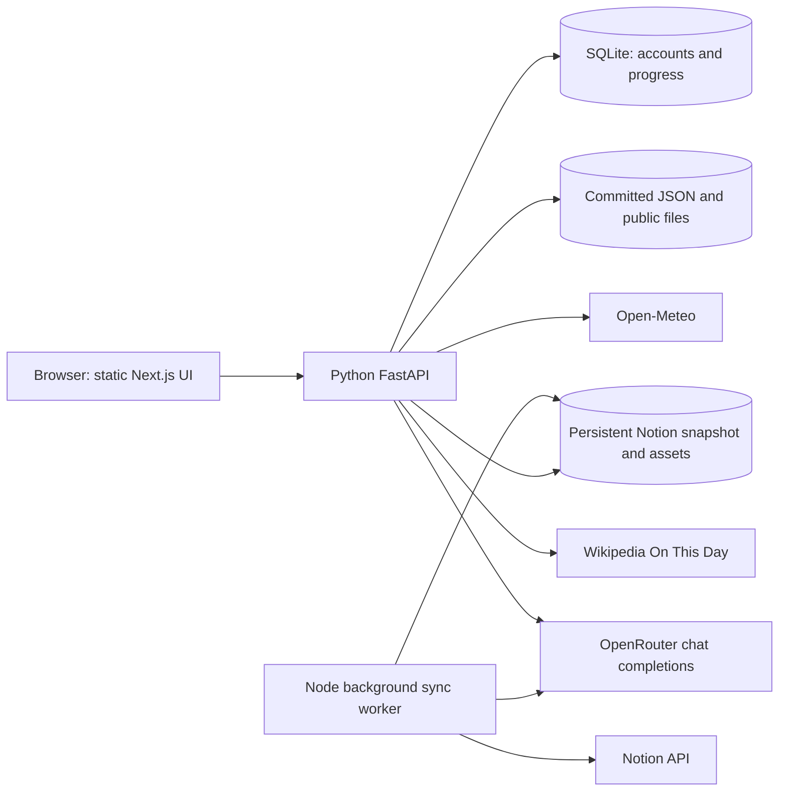

# Shreehan HQ — Project Specification and Rebuild Guide

**Document purpose:** This is the primary implementation, operations, and deployment reference for rebuilding Shreehan HQ in another environment. It describes the current repository as implemented, including its requirements, data, routes, integrations, environment configuration, and known limits.

**Last reviewed:** 2026-09-24
**Application package:** `shreehan-hq`
**Current application version:** `1.1.0` (CR 1, local review)

## 1. Product overview

Shreehan HQ is a responsive personal learning workspace for a Class II learner. It combines a learning dashboard, a Notion-fed document library, source-linked study questions, Unseen Paper practice, a document-grounded AI assistant, and a small Agile-style Kanban board. The UI is aimed at Shreehan and uses friendly language, accessible controls, responsive layouts, and account-scoped persistence for personal progress.

The Next.js App Router frontend builds to a static export. Python FastAPI serves that export at `/` and owns the live APIs, authentication, and SQLite persistence. A long-running Node worker can synchronize Notion content into local disk storage. The Docker image packages the frontend, backend, worker, PDF/OCR tools, and baseline data; a persistent volume holds SQLite and synchronized files.

### Product goals

- Make Shreehan’s learning material, tasks, schedule, and practice easy to find in one workspace.
- Preserve original imported files and let the learner read a page image beside extracted text.
- Keep question answers tied to source documents and pages.
- Provide an assistant that answers from relevant imported study material and cites its sources.
- Give Shreehan one simple Kanban board for learning projects and practicing an Agile flow.
- Keep the Kanban board deliberately limited: one board, five renameable columns, cards with a title and details, add/delete, and drag and drop. It has no archive, search, filters, multiple boards, or card metadata.

## 2. User-facing requirements and current behavior

### Account access

- `/login` provides sign-in, signup, email-code verification, first-time password setup, forgot-password verification, and new-password setup in one responsive flow. The screen uses the Kanban palette, animated stars, Outfit/DM Sans typography, and reduced-motion support.
- Signup accepts a preferred username and email. A six-digit, ten-minute OTP must be verified before a password can be created. A successful first password setup signs the learner in and opens the existing homepage.
- Sign-in uses username and password. Recovery uses an OTP sent to the registered email and invalidates existing sessions when the password changes. The dashboard profile offers sign-out and a Change password form. The signed-in session authorizes a password change; the user types the new password twice, without re-entering the current password. A successful change keeps the current session and closes other sessions.
- OTP email delivery uses SMTP when configured. In local `APP_ENV=development` without SMTP, the code is printed to the server log for testing and the signup page explains that it was not emailed. `APP_ENV=production` requires SMTP. SMTP delivery errors return a retryable error instead of a false success. OTPs are limited to five attempts.
- The OTP screen can request a new code after a one-minute cooldown. A new code replaces the previous challenge.
- New passwords require at least six characters in signup, recovery, and signed-in change flows. Passwords use PBKDF2-SHA256 with a unique salt. Session cookies are HttpOnly, SameSite=Lax, and Secure when `APP_ENV=production`; only token hashes are stored. Protected API routes require the session. FastAPI redirects unauthenticated page requests to `/login`.

### Learning workspace

- The `/` route presents the Shreehan HQ dashboard with Overview and My tasks views, plus the workspace’s learning collections.
- The sidebar links to the dashboard, document library, Digital Twin, Class 2 practice, and Project board.
- The homepage sidebar footer contains Change password and the account profile/sign-out controls. The workspace switcher still opens workspace information; there is no separate Help & workspace info item or decorative focus-note card.
- Dashboard Overview, My tasks, and the eight collection controls switch the view within `/`; the four module links open their own routes and each module provides a link back to the dashboard.
- Collections shown in the dashboard include Routine, Syllabus, Study Note, Assignment, Exam, Unseen Paper, CT, and Todo List.
- The dashboard includes sample tasks, an example weekly routine, exam schedule information, rotating encouragement, and a daily context panel. The routine and task seed data are examples, not live school data.
- Dashboard tasks can be added, completed, filtered, and saved per signed-in account through FastAPI and SQLite. Quick search is opened with Cmd/Ctrl+K. Each new account receives the sample task set.
- Daily context displays Dhaka weather and date-specific history when its external sources respond. Network failures leave the rest of the dashboard usable.
- The On this day feed requests Wikimedia data with an identifying User-Agent, as required by that provider, and shows Bangladesh events first when present, followed by world events.

### Document library and Class 2 practice

- `/library` opens the document browser. `/practice` opens the same library component in practice mode.
- Library/practice navigation opens the matching URL, including collection links as `/library?collection=...` and document-specific practice as `/practice?subject=...`, so refreshes and copied links retain the intended view.
- The library supports document search across metadata and extracted page text, collection and subject filters, document reading, page navigation, original-file downloads, extracted-text view, and an import audit report.
- The reader can display imported page previews, OCR/text method and confidence, review notes, and source-linked practice for a document.
- Practice supports searching and filtering prepared questions, revealing model answers, choosing multiple-choice answers, marking questions practiced, and opening a cited source page.
- Practice completion is saved per signed-in account in SQLite. Answer drafts and reveal state remain ephemeral in the current browser session.
- `docs/CLASS2_STUDY_GUIDE.md` describes source coverage and known gaps in the imported school material. Prepared answers are learning aids, not an official school answer key.

### Unseen Paper practice

- The Unseen Paper module is presented from the dashboard’s Unseen Paper collection.
- It groups eligible documents by subject and presents source-linked, question-and-answer practice. It supports answer reveal, multiple-choice or written responses, source-page links, and incremental question display.
- Reviewed questions from `data/unseen-practice.json` are used only when the document checksum and subject still match. Generated question state lives in `.notion-sync/unseen-practice.json` and is checkpointed by source version.
- The background worker can use OpenRouter to prepare questions for new or changed Unseen Paper files. It validates that every generated answer has an exact evidence excerpt from the source text, enforces the supported question formats, and rejects duplicate or unsupported answers.
- Unreadable scans and unsupported formats are surfaced for attention rather than answered by guessing.

### Shreehan Digital Twin

- `/assistant` provides chat and generated Q&A modes.
- The assistant page has a return link to the learning hub.
- Chat is a FastAPI route (`POST /api/assistant`) and uses retrieved page excerpts from the current library. Responses should rely on that context and include source identifiers; the UI links citations back to the library reader.
- The client keeps the visible conversation in React state for the current page session and sends up to ten previous messages with each request. It is not a saved conversation service.
- Q&A mode asks the model for five source-based study questions and answers in JSON. It falls back to displaying an unstructured provider response if JSON parsing fails.
- The API key remains server-only. Relevant extracted snippets are sent to OpenRouter as request context; there is no separate vector database or fine-tuning pipeline.

### Kanban Project board

- `/kanban` is the separate project-management module and is linked from the main dashboard sidebar.
- It starts with sample cards in five fixed columns: Ideas, Up next, In progress, Review, and Done.
- A column name can be edited in place. Columns cannot be added or removed.
- Cards contain only `title` and `details` as business data. A card can be added to a column, dragged into another column, or deleted.
- The board is saved in SQLite through `GET/PUT /api/board`, scoped to the signed-in account. Legacy `shreehan-kanban-v1` browser state is imported once on first visit and then removed. There is one private board per account and no collaboration.
- Visual palette: Accent Yellow `#ecad0a`, Blue Primary `#209dd7`, Purple Secondary `#753991`, Dark Navy `#032147`, and Gray Text `#888888`.
- Mobile columns scroll horizontally. The application has no Kanban archive, search, filtering, due dates, priorities, labels, comments, or user assignment.

## 3. Architecture



### Request and data flow

1. `npm --prefix frontend run build` produces `frontend/out/` locally; FastAPI serves its HTML, JavaScript, CSS, and baseline documents. The Docker image copies this export to `/app/out/`. Dynamic Next.js route handlers were moved to Python because a static export cannot use request-dependent handlers.
2. FastAPI initializes SQLite on startup and handles signup, OTP verification, password/session checks, board updates, tasks, and practice completion.
3. `/api/library` reads the current `library.json`, sync status, and unseen-practice state from `NOTION_SYNC_DIR` when present, with committed JSON fallback data when that disk state is absent.
4. The client library hook fetches `/api/library` at startup, on browser focus, and every 15 seconds. It exposes sync status and combines the curated practice bank with current, source-version-matching unseen questions.
5. The background worker talks directly to Notion, downloads attachments, creates previews and searchable page text, and atomically publishes a new snapshot only after a sync completes. The previous snapshot stays available after failure.
6. The assistant retrieves up to eight matching extracted pages (or up to four fallback pages), truncates each context passage to 5,500 characters, and sends that context to OpenRouter using `openai/gpt-oss-120b`.
7. The daily context API requests weather and history in parallel with eight-second timeouts. It uses a Dhaka local date and highlights Bangladesh events before world events.
8. Board, dashboard tasks, and practiced IDs use SQLite; the rotating-message choice alone remains browser-local. Existing browser-local board/tasks/practice state is migrated once when those pages are opened.

## 4. Technology stack

| Area | Current technology |
|---|---|
| Frontend framework and routing | Next.js `16.3.5`, App Router with `output: 'export'` |
| Backend | Python 3.12+; FastAPI, Uvicorn, Pydantic, HTTPX, python-dotenv |
| Persistence | SQLite via Python `sqlite3`; WAL mode, foreign keys, account-scoped tables |
| Authentication | Username/password, email OTP over SMTP, HttpOnly cookie sessions, PBKDF2-SHA256 |
| UI | React and React DOM `19.3.0`, TypeScript `5.9.3` |
| Styling | Tailwind CSS `4.3.3` via `@tailwindcss/postcss`, plus route/component CSS stylesheets |
| Icons | `lucide-react` `0.468.0` |
| OCR | `tesseract.js` `7.0.0`, using local English and Bangla trained data |
| PDF rendering and extraction | Poppler command-line tools: `pdftoppm` and `pdftotext` |
| Test tooling | pytest; Node built-in test runner; Playwright `@playwright/test` |
| Package managers | npm with committed `package-lock.json`; uv with committed `uv.lock` |
| Runtime | FastAPI serves the site; Node.js 22 runs the optional persistent Notion worker |
| Packaging | Multi-stage Docker image with `uv`, Poppler, English/Bangla OCR data, and persistent `/app/storage` volume |

There is no ORM, external authentication provider, queue service, or cloud object store. SQLite stores user state; JSON snapshots and files on disk store the imported library.

## 5. Repository map

| Path | Purpose |
|---|---|
| `frontend/app/page.tsx` | Dashboard, dashboard navigation, collection views, tasks, routine, exam schedule, and Unseen Paper entry point |
| `frontend/app/globals.css` | Global UI styles and shared workspace layout |
| `frontend/app/layout.tsx`, `frontend/app/components/auth-gate.tsx` | Root layout, client session guard, and application metadata |
| `frontend/app/login/page.tsx`, `frontend/app/login/login.css` | Animated sign-in, signup/OTP, first-password, and recovery UI |
| `frontend/app/kanban/page.tsx` | Kanban board API state, legacy-state migration, column rename, card actions, and native drag-and-drop |
| `frontend/app/kanban/kanban.css` | Kanban layout, responsive behavior, animations, and requested color palette |
| `frontend/app/library/page.tsx` | Document library route wrapper |
| `frontend/app/practice/page.tsx` | Class 2 practice route wrapper |
| `frontend/app/components/library.tsx` | Library, document reader, import report, and curated practice UI |
| `frontend/app/components/library.css` | Library and practice styles |
| `frontend/app/components/use-library.ts` | Polls the library API, builds sync labels, and filters stale practice against source checksums |
| `frontend/app/components/unseen-paper.tsx` | Unseen Paper study UI |
| `frontend/app/components/unseen-paper.css` | Unseen Paper styles |
| `frontend/app/assistant/page.tsx` | Assistant chat and Q&A UI |
| `frontend/app/assistant/assistant.css` | Assistant styles |
| `backend/main.py` | FastAPI application, static site host, API guards, and synced-asset route |
| `backend/auth.py`, `backend/mailer.py` | Account, OTP, password, session, and SMTP logic |
| `backend/db.py`, `backend/workspace.py` | SQLite schema/starter data and board/task/practice APIs |
| `backend/content.py` | Library, assistant/OpenRouter, and daily context APIs |
| `backend/tests/` | API/auth/persistence and content unit tests |
| `frontend/app/lib/unseen-practice.ts` | Shared unseen-practice data types |
| `frontend/app/lib/day-history.ts` | Dhaka date handling, Bangladesh event recognition, and event selection |
| `server/notion-sync.mjs` | Notion API client, page/data-source traversal, attachment handling, extraction, and snapshot reconciliation |
| `server/unseen-practice.mjs` | OpenRouter question generation, evidence validation, versioned checkpoints, and merged question bank |
| `scripts/serve.mjs` | Legacy Next.js development launcher; the integrated site uses FastAPI |
| `scripts/start.sh`, `scripts/stop.sh` | macOS/Linux local or Docker start and stop (`--docker`) |
| `scripts/start.ps1`, `scripts/stop.ps1` | Windows PowerShell local or Docker start and stop (`-Docker`) |
| `scripts/container-start.sh` | Starts the optional Notion worker and FastAPI within Docker |
| `scripts/sync-notion.mjs` | Background and one-shot Notion sync worker |
| `scripts/probe-notion.mjs` | Manual Notion API diagnostic helper |
| `scripts/import-notion.py` | Historical import/reconciliation helper for exported Notion archives; depends on local export files |
| `scripts/ocr-documents.cjs` | Historical OCR batch helper for the initial import queue |
| `scripts/build-practice.py` | Rebuilds the curated practice JSON and import report from its prepared source inputs |
| `data/library.json` | Committed baseline library snapshot; currently 30 documents, 83 pages, and 32 records |
| `data/practice.json` | Curated Class II practice bank; currently 108 questions and 30 document summaries |
| `data/unseen-practice.json` | Reviewed unseen-paper questions and source checksum records; currently 70 questions across 18 source records |
| `data/notion-source.json` | Import inventory/provenance structure used by historical import tooling; currently contains 8 database descriptors, 37 rows, and 39 page snapshots |
| `frontend/public/documents/` | Committed original document files, previews, and import report for the baseline library |
| `frontend/package.json`, `frontend/package-lock.json` | Frontend dependencies and npm scripts |
| `frontend/next.config.ts`, `frontend/postcss.config.mjs`, `frontend/tsconfig.json`, `frontend/next-env.d.ts` | Next.js, CSS processing, and TypeScript configuration |
| `frontend/playwright.config.ts`, `frontend/tests/` | Browser and frontend-adjacent integration tests |
| `Dockerfile`, `.dockerignore` | Reproducible Docker build and runtime image |
| `pyproject.toml`, `uv.lock` | Python dependency specification and locked versions |
| `docs/DATABASE_SCHEMA.json`, `docs/DATABASE_APPROACH.md` | Proposed versioned SQLite schema and rationale; awaiting user sign-off |
| `docs/CLASS2_STUDY_GUIDE.md` | Source coverage, preparation method, caveats, and syllabus gaps |
| `.env.example` | Names and examples of server environment variables; contains no live credentials |
| `AGENTS.md` | Repository-specific Next.js instructions; check the installed Next.js docs before changing framework APIs |

## 6. Routes and API contracts

### Pages

| Route | Purpose |
|---|---|
| `/login` | Sign-in, signup with email OTP, first password, and verified recovery |
| `/` | Main dashboard and learning workspace |
| `/library` | Search, filter, and read imported documents |
| `/practice` | Curated and current source-matched Class II practice |
| `/assistant` | Digital Twin chat and generated Q&A |
| `/kanban` | Single-board Agile/Kanban module |

### API routes

| Method and route | Request | Response and notes |
|---|---|---|
| `POST /api/auth/signup` | `{ username, email }` | Creates an unverified account and generates a six-digit OTP. Response includes `delivery: "email"` when SMTP accepted the message or `"development_log"` for the local no-SMTP fallback. |
| `POST /api/auth/verify-signup` | `{ email, code }` | Returns a short-lived opaque `ticket` after OTP verification. |
| `POST /api/auth/resend-code` | `{ email, purpose: "signup" or "password_reset" }` | Replaces an expired/used OTP after a one-minute cooldown. |
| `POST /api/auth/set-password` | `{ ticket, password }` | Sets first password (minimum six characters), creates sample board/tasks, and starts a session. |
| `POST /api/auth/login`, `POST /api/auth/logout` | `{ username, password }` for login | Creates/revokes an HttpOnly cookie session. |
| `POST /api/auth/change-password` | `{ new_password, confirm_password }` plus session cookie | Requires an active session, checks matching new values and rejects password reuse, updates the hash, and revokes other sessions. |
| `POST /api/auth/forgot-password`, `POST /api/auth/verify-reset`, `POST /api/auth/reset-password` | Email, then email/code, then ticket/new password | Verified recovery; reset invalidates prior sessions. |
| `GET /api/auth/me` | Session cookie | `{ id, username, email }` or HTTP 401. |
| `GET/PUT /api/board` | PUT `{ columns: [{ id, name, cards: [{ id, title, details }] }] }` | Reads/replaces the current account's one board. Exactly five original column IDs, original order, and unique card IDs are enforced. |
| `GET/PUT /api/tasks` | PUT `{ tasks: [{ id, title, subject, priority, done }] }` | Account-scoped dashboard tasks. |
| `GET/PUT /api/practice-progress` | PUT `{ known: [questionId] }` | Account-scoped practiced question IDs. |
| `GET /api/library` | No body | `{ library, sync, unseenPractice }`; uses committed JSON fallbacks. |
| `GET /api/documents/:folder/:filename` | Two safe path components | Authenticated file bytes from synchronized assets; validates path segments and sets safe content headers. |
| `POST /api/assistant` | `{ message, mode?, history? }`; message is 1–4,000 characters; mode is `chat` or `qa` | Chat returns `{ mode, answer, sources }`; Q&A returns `{ mode, qa, sources }`. Uses a 60-second provider timeout. Missing key returns HTTP 503; invalid body or prompt returns 400; provider errors return 502. |
| `GET /api/day-context` | No body | Dhaka date, weather, history events, and weather/history availability metadata. External calls time out after eight seconds. |

All content/workspace APIs require a valid session. FastAPI serves exported frontend files and redirects unauthenticated page requests to `/login`; `_next` build assets remain publicly loadable so the login screen works. API errors use `{ "error": "..." }` for application errors; Pydantic validation errors use FastAPI's standard validation response.

## 7. Data formats and persistence

### Committed data

- `data/library.json` contains workspace metadata and arrays of `documents`, `records`, and `missing` IDs, plus `expectedAttachments`, import/sync timestamps, scope, and OCR status. A document contains a stable source ID, title, filename, collection, subject, source URL, local URL, file type, byte size, SHA-256 checksum, and page array. A page contains its page number, image URL, extracted text, extraction method, and optional OCR confidence.
- `data/practice.json` contains grade/school metadata, question objects, per-document analysis, and a coverage note. Questions include type, prompt, answer, options, and source document/page references.
- `data/unseen-practice.json` contains reviewed `sources` and `questions`. Questions cite document IDs and page numbers; source entries are guarded by document checksum and subject.
- `frontend/public/documents/` contains the baseline originals and page previews addressed by the baseline JSON. Keep the root `data/` JSON and its referenced public files together when copying the project.

### Runtime disk state

`NOTION_SYNC_DIR` (default `.notion-sync/`, Docker `/app/storage/notion-sync/`) is generated at runtime and ignored by Git. Important files include:

- `library.json`: latest successful synchronized library snapshot.
- `status.json`: `starting`, `syncing`, `ok`, `partial`, `error`, or `unconfigured` state plus last success and counts.
- `assets/`: original downloaded attachment and rendered page assets, keyed by attachment identity and content checksum.
- `cache.json`: Notion edit-time and file identity cache to avoid reprocessing unchanged sources.
- `unseen-practice.json`: versioned generated questions, progress, retry state, and evidence-approved results.
- `lock` and `unseen.lock`: process locks that prevent overlapping sync and generation jobs.

Snapshots are written with a temporary file followed by rename. Failed syncs preserve the last successful library; extraction failures preserve the original attachment and mark text extraction for retry.

### SQLite schema and browser migration

The detailed schema is recorded as JSON in [DATABASE_SCHEMA.json](./DATABASE_SCHEMA.json), with rationale in [DATABASE_APPROACH.md](./DATABASE_APPROACH.md). The SQLite file is created when FastAPI starts (`DATABASE_PATH`, default `data/shreehan.db`; Docker `/app/storage/shreehan.db`). Foreign keys and WAL are enabled; `PRAGMA user_version=1` marks the initial schema. The principal tables are `users`, `otp_challenges`, `sessions`, `boards`, `columns`, `cards`, `dashboard_tasks`, and `practice_progress`. A unique board/user constraint enforces one board per account. All mutable API queries derive ownership from the session, not from a submitted user ID. This schema was proposed for explicit user sign-off in CR 1; any requested change should update the JSON, this document, and the implementation together.

Password hashes, OTP hashes, and session token hashes are stored instead of plaintext values. OTP challenges expire after ten minutes; verification allows five attempts. Board and task PUT requests are transactional. SQLite and Notion snapshots need backup together for a full restore.

On first visit after upgrade, valid legacy browser state for board, tasks, or practice progress is sent to the account's API and removed from local storage after success. Each new account receives sample board cards and three sample tasks. The remaining browser-local value is:

| Key | Stored information |
|---|---|
| `shreehan-last-hero-message` | Last rotating dashboard message selection |

Account data follows the learner between browsers that sign into the same server/database. The app still has no multi-user board collaboration or conflict resolution between simultaneously open editing tabs; last completed board/task update wins.

## 8. External integrations

### Notion

- API base: `https://api.notion.com/v1/`; API version header: `2025-09-03`.
- Authentication: internal integration token in `NOTION_TOKEN` (server-only).
- The integration must belong to the workspace named `Shreehan` and must be explicitly connected to the pages/data sources it needs to read.
- The sync worker discovers shared pages and data sources, queries data sources, traverses child blocks/pages/databases, extracts text and dates, and reconciles file/image/PDF attachments. The intended scope is active content shared with that integration; it is not a teamspace-wide permission bypass.
- Pagination is handled at 100 items per request. Rate-limit and server errors are retried. The client spaces requests and rechecks pages missing from search before removing them from a snapshot.
- Attachment downloads require HTTPS, resolve only public IP addresses, allow at most five redirects, cap file size at 100 MB, and time out after 60 seconds.
- Notion-hosted expiring download links and the token are kept on the server. Browser document URLs point to this app’s local file route.

### OpenRouter

- API: `https://openrouter.ai/api/v1/chat/completions`.
- Required secret: `OPENROUTER_API_KEY`.
- Model: `openai/gpt-oss-120b` for the FastAPI assistant. The background Unseen Paper generator defaults to this same slug via `OPENROUTER_MODEL`.
- Used for assistant chat/Q&A and background unseen-paper question generation.
- Study Q&A uses JSON response mode where supported. Unseen questions are checked against a verbatim source excerpt before they are saved or shown.
- For Digital Twin prompts, selected library excerpts and the current conversation history are sent to the provider. Do not represent this flow as local-only inference.

### Daily public-data services

- Weather is requested from Open-Meteo for Dhaka coordinates `23.8103, 90.4125` with `Asia/Dhaka` timezone.
- Date-specific events are requested from the Wikipedia On This Day REST feed. A small local set supplements national commemorations for February 21, March 26, and December 16. Bangladesh-related events are selected ahead of world events.
- Both requests are independent; one can fail while the other succeeds.

## 9. Environment configuration

Copy `.env.example` to `.env` and provide values on the server. Never commit real values. Secrets must not use a `NEXT_PUBLIC_` prefix. FastAPI reads root `.env` at startup, the local start scripts pass it to both processes, and Docker uses `--env-file .env`. Restart after changing values.

| Variable | Required | Purpose |
|---|---:|---|
| `NOTION_TOKEN` | For live library sync | Internal Notion integration token. Without it, the committed baseline still serves. |
| `NOTION_SYNC_INTERVAL_SECONDS` | No | Check-start cadence; defaults to `60`, minimum effective interval is `30` seconds. |
| `OPENROUTER_API_KEY` | For AI features | Server-side key for the assistant and generated unseen questions. Without it, curated content works but live AI requests do not. |
| `OPENROUTER_MODEL` | No | Background unseen-question model slug; default `openai/gpt-oss-120b`. The assistant uses that requested model directly. |
| `DATABASE_PATH` | No | SQLite file path; local default `data/shreehan.db`, Docker `/app/storage/shreehan.db`. |
| `NOTION_SYNC_DIR` | No | Runtime Notion snapshot/asset directory; local default `.notion-sync`, Docker `/app/storage/notion-sync`. |
| `APP_STATIC_DIR` | No | Static Next export directory; default `frontend/out/` locally and `/app/out/` in Docker. |
| `APP_ENV` | No | `development` enables local log OTP fallback; `production` requires SMTP and marks session cookies Secure. |
| `SMTP_HOST`, `SMTP_PORT` | For real email OTP | SMTP server and port (default 587). Port 587 uses STARTTLS; port 465 uses implicit TLS. |
| `SMTP_USERNAME`, `SMTP_PASSWORD`, `SMTP_FROM` | For configured SMTP | SMTP credentials and sender address. |
| `OCR_MODEL_DIR`, `OCR_CACHE_DIR` | No | Paths for English/Bangla OCR trained data and cache. Docker supplies installed trained data. |

The current root `.env` includes an OpenRouter key but no SMTP settings. Until an SMTP service is configured, local development writes OTPs to its server log. Do not expose a development-mode instance publicly. In production, set `APP_ENV=production`, configure SMTP, put the site behind HTTPS, and mount persistent storage.

## 10. Local development and clean-room rebuild

1. Install Node.js 22, npm, Python 3.12+, and uv. For live extraction install Poppler (`pdftoppm`, `pdftotext`) and English/Bangla Tesseract trained data. Docker bundles these tools.
2. Clone/copy the repository, preserving `frontend/package.json`, `frontend/package-lock.json`, `pyproject.toml`, `uv.lock`, `data/`, and `frontend/public/documents/`.
3. Run `npm ci --prefix frontend` and `uv sync`. Create `.env` from `.env.example`; set `OPENROUTER_API_KEY`, `NOTION_TOKEN` if desired, and SMTP details for real OTP email. Keep `.env` out of version control.
4. Run `./scripts/start.sh` on macOS/Linux or `./scripts/start.ps1` in Windows PowerShell; open `http://localhost:8000`. The scripts check whether the port is already serving an app before starting, build `frontend/out/`, start FastAPI on `localhost`, wait for `/login` to respond, and then start the Notion worker. Use the matching stop script to stop both. Alternatively run `npm --prefix frontend run build` and `uv run --env-file .env uvicorn backend.main:app --host localhost --port 8000` manually. Run only one local or Docker instance against this URL to avoid reaching different SQLite account stores.
5. For Docker, run `./scripts/start.sh --docker` or `./scripts/start.ps1 -Docker`. The script resolves `localhost` to an IPv4 loopback address for Docker's port-publishing interface, and mounts the named `shreehan-data` volume. Open the app at `http://localhost:8000`. The matching stop command removes the container but retains the volume.
6. For live Notion, create an internal integration in the Shreehan workspace and share intended parent pages/data sources with it. The bundled Node worker synchronizes at the configured interval.
7. Validate with the checks in Section 12.

The app can start without Notion using the committed baseline. In development without SMTP, read the one-time code in the server log after submitting signup or recovery. Live attachment extraction needs writable disk and the system tools above. Scanned or legacy-font Bangla pages can have OCR errors; source images remain available for manual review.

## 11. Production deployment and operations

### Supported shape

Use the Docker image or a persistent Python/Node host with writable local storage. The Docker build compiles the Next.js static export, installs locked Python packages with uv, and includes the Node sync worker, Poppler, and English/Bangla OCR data. FastAPI serves port 8000. Put HTTPS in front of it and configure secrets in the host's secret manager or an untracked env file.

The deployment must keep these paths available and writable/persistent:

- `data/shreehan.db` locally, or `/app/storage/shreehan.db` in Docker, for account and board data.
- `NOTION_SYNC_DIR` for sync snapshots, generated practice, cache, locks, and downloaded runtime assets.
- `OCR_CACHE_DIR` for OCR cache; the Docker image supplies trained data at `OCR_MODEL_DIR`.
- `frontend/out/documents/` locally (or `/app/out/documents/` in Docker) for the committed baseline originals and previews, copied from `frontend/public/documents/` during build.

Back up the SQLite file and Notion sync directory together. Keep the named Docker volume when replacing a container. The app uses committed baseline data when runtime sync data is not yet present.

### Deployment constraints

- The Notion worker requires a long-lived process and persistent disk. A normal Vercel/serverless deployment cannot host this architecture without redesigning the worker and storage.
- SQLite and Notion assets are local files. Multiple app replicas need shared storage and coordinated access; this single-container design is intended for one running instance.
- SMTP must be configured with `APP_ENV=production` so signup and recovery codes are actually emailed. HTTPS is needed for Secure cookies.
- The static export includes baseline library data in frontend bundles; auth protects runtime APIs and page delivery but cannot make those bundled baseline files confidential. If strict confidentiality is required, move that baseline data out of client bundles before public deployment.
- Provider availability, Notion permissions, outbound HTTPS, local storage capacity, and OCR packages affect only their corresponding integrations; the committed baseline remains the fallback.

### Operational behavior

- FastAPI lifespan owns a supervised Notion worker on every startup path, including Docker and direct uvicorn. An OS advisory lease prevents duplicate supervisors.
- Sync checks start immediately and on a 60-second cadence (configurable, minimum 30 seconds), without overlapping. Failed workers retry automatically; missing progress for 180 seconds or an overlong cycle triggers termination and retry. Question preparation runs independently.
- Each sync updates status, preserves the last good snapshot on error, and reports partial status when extraction is pending.
- The library client refreshes in open tabs every 15 seconds and on focus.
- Inspect `NOTION_SYNC_DIR/status.json` and server logs for sync state. Error logging redacts the Notion token and signed URLs. Development OTP codes appear in local logs by design; protect those logs.

## 12. Verification and test strategy

Run the following from the repository root:

```sh
npm --prefix frontend run typecheck
npm --prefix frontend run build
npm --prefix frontend run test:sync
uv run pytest -q
E2E_BASE_URL=http://localhost:8000 E2E_USERNAME=<local-test-user> E2E_PASSWORD=<local-test-password> npm --prefix frontend run test:e2e -- tests/cr1.spec.ts
E2E_BASE_URL=http://localhost:8000 E2E_USERNAME=<local-test-user> E2E_PASSWORD=<local-test-password> npm --prefix frontend run test:e2e -- tests/navigation.spec.ts
E2E_BASE_URL=http://localhost:8000 E2E_USERNAME=<local-test-user> E2E_PASSWORD=<local-test-password> npm --prefix frontend run test:e2e -- tests/account-fixes.spec.ts
docker build -t shreehan-hq .
```

- `npm --prefix frontend run typecheck` performs `tsc --noEmit`.
- `npm --prefix frontend run build` compiles and statically exports the production Next.js app to `frontend/out/` and checks TypeScript as part of the build.
- `npm --prefix frontend run test:sync` runs Node tests for pagination, URL safety, sync snapshot reconciliation/failure handling, locks, extraction retry state, and unseen question validation/checkpointing.
- `uv run pytest -q` tests signup/OTP/password reset, cookie sessions, database creation, board/task/practice persistence, API guards, and library retrieval/merge behavior.
- `frontend/tests/cr1.spec.ts` tests redirect to login, sign-in, five columns, add/rename/drag/delete, dashboard tasks, practice completion, and SQLite persistence across reloads in the FastAPI-hosted site. It needs a verified local test account. `frontend/playwright.config.ts` reads `E2E_BASE_URL`, defaulting to the legacy Next server at `http://localhost:3000`. Earlier Playwright specs target the former no-login Next runtime and need authenticated fixtures before running against this architecture.
- `frontend/tests/navigation.spec.ts` signs in and covers dashboard internal views, a collection-to-library link, each of the four primary module routes and return links, library/practice cross-navigation, and browser/server errors.
- `frontend/tests/account-fixes.spec.ts` covers the loaded On this day dialog, password confirmation feedback, and truthful signup OTP delivery feedback. Backend tests cover password update rules and a mocked SMTP send to the requested address.
- Docker build verifies the complete image; a container smoke test should check `/login` and database creation with a persistent volume.
- Live Notion specs require synchronized state and working integration credentials. Provider-generation tests use injected fakes in unit tests; tests against actual OpenRouter should be treated as separately authorized live tests.
- Keep the Kanban route spec and database schema in sync with its requirements when changing column behavior, card fields, drag and drop, or persistence.

Do not print or attach `.env` values in test logs. Use mocked Notion/OpenRouter API calls for routine CI tests and reserve live integration runs for a configured private environment.

## 13. Requirements for future project changes

When a later user request changes the project, update this document in the same change set:

1. Update the relevant requirements, route/API, data, integration, deployment, or test section so it describes current behavior.
2. Append a dated entry to the chronological **Project change log** at the bottom of this file. Summarize the user-requested change, affected routes/files, and validation performed.
3. Preserve prior entries. If a correction supersedes earlier information, correct the main specification and append a log entry explaining the correction.
4. Never include credentials, private tokens, or personal secret values in this document.

## Project change log

### 2026-09-23 — Primary rebuild and deployment specification

- Created this document after reviewing the app routes, UI components, API handlers, Notion sync worker, AI question generation, static data, local persistence, configuration, deployment constraints, and existing tests.
- Recorded the current single-board Kanban scope and palette, current dataset counts, environment variable names, external service contracts, clean-room setup, and the persistent-disk deployment requirement.
- Updated stale Playwright assertions to match current dashboard and Unseen Paper copy, and added `tests/kanban.spec.ts` to cover the board’s core requirements.
- Validation: `npm run typecheck` passed; `npm run build` passed; `npm run test:sync` passed all 10 tests; `npx playwright test` passed all 18 browser tests (including the two Kanban flows).

### 2026-09-23 — Code review

- Added [CODE_REVIEW.md](./CODE_REVIEW.md) with findings, positive controls, review limits, and follow-up priorities.
- The review confirmed no app code changes were made as part of that review. It records access-control and assistant-validation risks for follow-up.

### 2026-09-23 — CR 1: account access, SQLite persistence, FastAPI, and Docker

- Implemented the user-requested signup/email OTP/first-password, username sign-in, verified password recovery, session-protected APIs, and a redesigned login screen. New accounts receive a sample five-column board and three dashboard tasks.
- Moved request-dependent library, document, assistant, and daily-context routes to FastAPI; exported the Next.js frontend as static files and served it through FastAPI. The assistant uses the root `.env` OpenRouter key and `openai/gpt-oss-120b`.
- Added SQLite account-scoped board, dashboard task, and practice-progress storage. The client uses these APIs and migrates valid legacy browser state once. Proposed schema and database rationale are in `DATABASE_SCHEMA.json` and `DATABASE_APPROACH.md`; explicit schema sign-off was requested and is pending.
- Added uv-managed Python dependencies, macOS/Linux and Windows start/stop scripts, and a Docker image with a persistent volume, Notion worker, PDF tools, and OCR data. SMTP configuration is still needed for real email delivery; local development emits OTPs to the server log.
- Validation during implementation: static Next build and TypeScript passed; 10 Node sync/generation tests and 6 Python tests passed; the authenticated Playwright flow for login, board, dashboard tasks, and practice persistence passed; the Docker image built, created SQLite, served `/login`, redirected unauthenticated `/`, and completed a live Notion sync. A live `openai/gpt-oss-120b` assistant request returned an answer with eight sources. Existing pre-CR Playwright specs need authenticated fixtures before they can serve as full-suite regression coverage.
- Kept all changes local for user review; no GitHub push or deployment was requested for this change.

### 2026-09-23 — Local review account

- Provisioned the requested `adm` account directly in the running Docker container's persistent SQLite database, marked it verified, and created its sample board and tasks. This is runtime data, not a committed seed account; a clean installation starts without it.
- Verified `POST /api/auth/login` succeeded and the authenticated board API returned five columns. The credential itself is intentionally omitted from this document.

### 2026-09-23 — Navigation reliability after login

- Resolved conflicting local servers that were serving different SQLite databases on the same port; stopped the duplicate local FastAPI process and kept the Docker instance as the single server. The start scripts now refuse an already occupied app port, and Docker binds to the machine's loopback interface.
- Made library/practice controls navigate to their real routes, including collection and subject query links, and added a dashboard return link to the assistant page.
- Added authenticated browser coverage for dashboard views and collection navigation, all four module pages and return links, and library/practice cross-navigation. Validation: production frontend build, six Python tests, shell syntax check, Docker image build, single-listener check, and the Playwright navigation spec all passed. Changes remain local for review.

### 2026-09-23 — Daily history, password change, and signup OTP delivery

- Added Wikimedia's required identifying User-Agent to the server-side On this day request. A live authenticated check returned eight world events and reported the feed available.
- Added a signed-in Change password form and API requiring the current password plus matching new-password and confirmation fields. The current session remains active; other sessions are revoked.
- Corrected signup and resend feedback so local log-only OTPs are not described as emailed. SMTP delivery failures now return an error, and the mailer supports ports 587 (STARTTLS) and 465 (implicit TLS). This environment still has no SMTP credentials, so real inbox delivery awaits provider configuration.
- Validation: frontend production build and typecheck, eight backend tests, Docker image build, live history API check, and three combined navigation/account browser tests passed. Changes remain local for review.

### 2026-09-23 — Session-authorized password change

- Removed the current-password field and check from the signed-in Change password flow at the user's request. The session remains required, and the new password must be entered twice; the API also rejects reusing the existing password.
- Updated the API and browser regression tests for the revised form. Validation: production frontend build, eight backend tests, Docker image build, and three authenticated browser tests passed against the refreshed local container. Changes remain local for review.

### 2026-09-23 — Six-character password minimum

- Changed new-password validation from ten to six characters in signup, password recovery, and the signed-in change form, including both the browser controls and FastAPI request models.
- Added backend checks that five-character passwords are rejected and six-character passwords work in all three flows; updated browser coverage for the change form. Validation: production build, nine backend tests, Docker rebuild, and three browser tests passed against the refreshed local container. Changes remain local for review.

### 2026-09-23 — Homepage sidebar simplification

- Removed the decorative focus-note card from the homepage sidebar. Help, Change password, and account controls remain in the footer.
- Rebuilt and checked the local app; changes remain local for review.

### 2026-09-23 — Homepage help item removal

- Removed the separate Help & workspace info item from the homepage sidebar footer. Change password and account controls remain; the workspace switcher continues to open the existing information dialog.
- Rebuilt the local app for review. No GitHub push was made.

### 2026-09-23 — Login database alignment

- Login failed because port 8000 was serving the local `data/shreehan.db`, while the existing `adm` and `adm1` accounts were stored in the persistent Docker volume. Switched the app back to the Docker container on port 8000, keeping the existing volume.
- Verified both accounts successfully authenticated against the running app and logged out the verification sessions. No passwords or hashes were changed.

### 2026-09-23 — Frontend directory organization

- Moved the Next.js application, public baseline document assets, frontend package/configuration files, and browser/frontend tests into `frontend/`. Shared JSON datasets remain in root `data/` because the frontend build and FastAPI backend both consume them; backend code, scripts, documentation, and deployment files remain at the root.
- Updated Docker build stages, local start scripts, Notion sync/import tooling, backend static-file defaults, README instructions, and this project guide to use the new paths. The static export is generated under `frontend/out/` locally; Docker copies it to `/app/out/` for FastAPI.
- Validation: frontend TypeScript check and production static build passed; all 10 Node sync/generation tests and all 9 backend tests passed; `docker build -t shreehan-hq:frontend-layout .` passed. One first backend-test attempt overlapped the build while it replaced `frontend/out/`; the sequential rerun passed. The running container was left untouched so its current service state and named data volume were preserved.

### 2026-09-24 — Localhost URLs and launch scripts

- Changed documented and user-facing local app addresses and the local FastAPI bind host to `localhost`. The Docker launch scripts resolve `localhost` to a loopback IP at runtime because Docker's published-port interface requires an IP literal; users still open the app at `http://localhost:8000`.
- Improved Unix and PowerShell launch scripts with a `.env` preflight and an HTTP readiness check before reporting startup success. Unix stop now handles absent or stale PID files and reports a process that fails to stop; Docker stop is safe to call when the container is absent and retains `shreehan-data`.
- Validation: `sh -n scripts/start.sh scripts/stop.sh`, frontend typecheck/build, 10 sync tests, and 9 backend tests passed. Exercised `./scripts/stop.sh --docker` followed by `./scripts/start.sh --docker`; the rebuilt container passed its internal login readiness check, host `http://localhost:8000/login` returned HTTP 200, unauthenticated `/api/board` returned 401, and the SQLite user count remained 4 on the retained `shreehan-data` volume. PowerShell script changes were not executed on this macOS host. The network security test intentionally retains numeric loopback addresses as SSRF-blocking fixtures; these are not app URLs or bind configuration.


### 2026-09-24 — Repair live Notion freshness and container restart recovery

- Confirmed the running Docker volume had an obsolete numeric lock `9`. The restarted container reused PID 9, so the old daemon skipped every sync while the UI stayed at “syncing.” A successful API credential check and a separate host snapshot had not established freshness of the live app.
- Replaced numeric locks with process-start, kernel boot and container identity, plus unique ownership. Migrates stale legacy locks. FastAPI now supervises the worker itself, using an OS-released leadership lease, periodic heartbeats, retry, timeout and process-group cleanup. AI question generation cannot delay imports.
- Library responses are uncached and derive health from both worker heartbeat and last successful reconciliation. The UI reports delayed/stale content and displays the sync date as well as time. Browser refresh remains every 15 seconds.
- Additions, attachment changes/removal, page edits/renames, archived pages and confirmed 404 removals reconcile into the published index. Notion API errors preserve the last complete snapshot. Deleted originals remain on disk for recovery; they are removed from the active library index and both legacy and runtime download routes reject their old links.
- Imported the missing `HALF YEARLY` syllabus (`syllabus_c22_s16_20260924_46e533.pdf`) into the actual Docker-backed library: 43 files, 37 records, no extraction backlog at reconciliation.
- Scope remains all pages shared with the Shreehan integration. A local Docker app checks while Docker and the server run; it catches up at startup. Notion/network outages are surfaced and retried, not silently presented as current data. This is polling, not an instant webhook guarantee.

- Validation: 12 Node reconciliation/generation tests and 13 Python API/supervision tests passed; frontend typecheck and Docker production build passed. Authenticated browser checks passed for the actual HALF YEARLY syllabus, original checksum/download, reader text, 15-second polling of additions/edits/removals, stale-status messaging, and navigation. The final authenticated suite also verifies no obsolete documents render before live data loads (four browser checks). A restart during sync recovered automatically and completed a fresh reconciliation; temporary browser-test account was removed, retaining the original four accounts.

- Browser initialization now waits for the current library response instead of rendering the obsolete bundled snapshot. This prevents deleted files from flashing in the UI or requesting revoked previews during hydration.


### 2026-09-24 — Notion Homework List

- Replaced the obsolete Todo List collection with Homework List, connected to the existing Notion Homework page. The separate personal My tasks feature is preserved. Homework List displays source instructions, nested text, Notion checklist completion, dates, source links and attached documents. It has search and checklist-status filters.
- Sync records retain block IDs and checked state; Homework classification follows its root and child pages/databases. Additions, edits and removals use the existing supervised synchronization and live refresh. Instructions and completion are edited in Notion; this view does not invent local completion state for ordinary bullet points.
